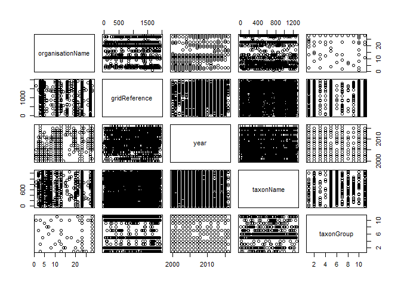

tutorialmark
================

i’m learning about r markdown

``` r
edidiv <- read.csv("edidiv.csv")
summary(edidiv)
```

    ##  organisationName   gridReference           year       taxonName        
    ##  Length:25684       Length:25684       Min.   :2000   Length:25684      
    ##  Class :character   Class :character   1st Qu.:2006   Class :character  
    ##  Mode  :character   Mode  :character   Median :2009   Mode  :character  
    ##                                        Mean   :2009                     
    ##                                        3rd Qu.:2011                     
    ##                                        Max.   :2016                     
    ##   taxonGroup       
    ##  Length:25684      
    ##  Class :character  
    ##  Mode  :character  
    ##                    
    ##                    
    ## 

esto es un summary de edidiv

``` r
plot (edidiv)
```

<!-- -->
